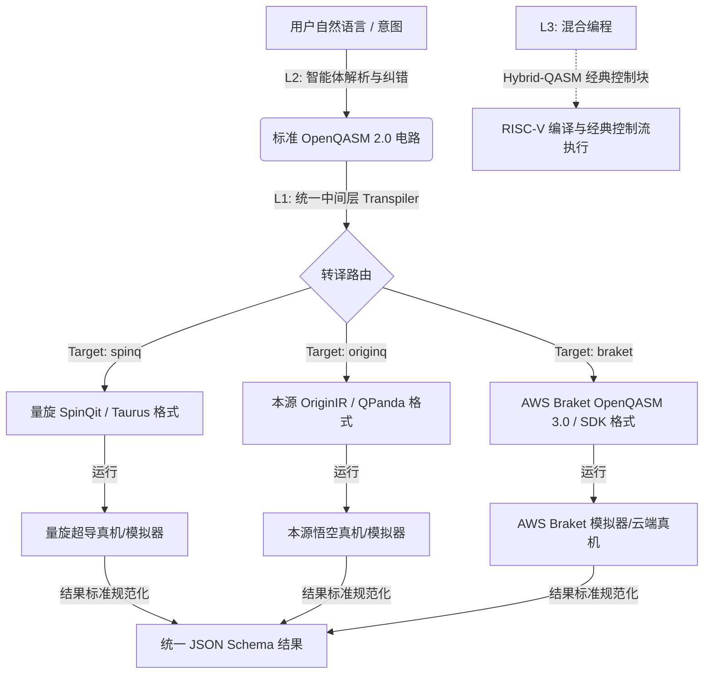

# LoomQ 提交说明

这是一个把"OpenQASM 2.0 电路"统一转译并执行到三个异构量子后端（SpinQit / AWS Braket / 本源量子）的中间层，
在此之上叠加一个用自然语言操作的 AI Agent（L2），以及一个把量子测量结果接入经典控制流的混合编译器（L3）。

## 快速上手（一键跑通）

```bash
bash setup.sh
python3 evaluator.py --level l1 --target spinq,braket,originq
```

`setup.sh` 会自动创建虚拟环境、安装依赖、并做一次环境自检（哪个包 import 失败会直接告诉你，而不是让你自己
去翻 pip 报错）。如若测试 L2 或启动网页入口，需先设置好三个环境变量（见下方"L2 环境变量"一节），再跑：

```bash
python3 evaluator.py --level l2
python3 app.py   # 网页入口，浏览器打开 http://127.0.0.1:5000
python3 evaluator.py --level l3
```

## 架构



**每个 `targets/*.py` 都遵循同一个模式**：`transpile_*()` 负责把 OpenQASM 2.0 转成该平台的原生格式
（对齐 `target_ir_contract.md`），`run_*()` 负责实际执行并把结果归一化成统一 JSON Schema——包括处理每个
平台不同的测量位序约定（SpinQit/Braket 原生是大端书写，需要反转；OriginQ 原生就是契约要求的格式，不用反转）。

## 谁因为这个工具第一次能用上量子计算？

**答案：有真实想法、但从没写过量子程序的人**——比如一个想验证"用量子算法加速某个优化问题"的研究生，
一个想给学生演示量子纠缠的老师，或者单纯好奇"薛定谔的猫到底怎么写成代码"的爱好者。这类人卡在门槛前的
原因通常不是"不聪明"，而是一些很具体的事：

1. **三个平台、三套语法，学习成本乘以三**。SpinQit 用 OpenQASM2、Braket 要求 OpenQASM3、本源量子用
   OriginIR——同一个贝尔态电路，在三个平台上长得完全不一样。我们的中间层把这件事对用户屏蔽掉：写一份
   标准 OpenQASM 2.0，三个后端都能跑，用户不需要知道 `cu1` 在 Braket 里要叫 `cphase`、在 OriginQ 里
   会被拆成 `P+CNOT`。

2. **不会写量子门语法，但会用中文描述想法**。这正是 L2 `agent_chat` 解决的问题——"帮我做一个3比特的
   GHZ态"这句话，任何人都会说，但要求他知道 `h q[0]; cx q[0],q[1]; cx q[1],q[2];` 这几行怎么写，
   门槛立刻拔高。而我们的Agent可以直接把自然语言变成可执行、已经自验证过的电路。

3. **不会写代码，但会点鼠标**——这是网页入口（`app.py`/`index.html`）存在的意义。命令行对完全没有编程
   背景的人本身就是一道墙，而网页聊天界面把这道墙也去掉了：打开浏览器，打字，得到结果。生成的代码块自带复制
   按钮，用户不需要任何编程相关背景知识即可得到一个量子程序。

三者叠加起来，我们想覆盖的是"**有量子计算的应用需求、但没有量子计算的工程背景**"这一类人。

## 代码组织与质量说明

- `adapter.py`：唯一的对外契约入口，具体逻辑全部委托给 `targets/*.py` 和 `compiler.py`，自身不包含业务逻辑，
  方便审查每个后端/层级各自的正确性而不互相干扰。
- 每个 `targets/*.py` 内部有清晰的三段分层：门名映射 / 寄存器与测量补全 / 位序归一化。
- `compiler.py`（L3）是一个真正的词法分析 → 语法分析 → 代码生成三段式微型编译器，不是字符串替换或
  模式匹配，能正确处理评测时随机生成的、结构不同的隐藏用例（已用无 else 分支、`!=`、多测量位映射、
  减法、寄存器间运算等场景本地验证过）。

## L2 环境变量

`agent_chat` 需要三个环境变量指向一个 OpenAI 兼容的 LLM 服务：

```bash
export LOOMQ_LLM_BASE_URL="..."
export LOOMQ_LLM_API_KEY="..."
export LOOMQ_LLM_MODEL="..."
```

注：本地开发时使用 Groq 免费额度测试。

## 常见问题

以下问题主要出现在**本地 macOS 开发环境**：

- **`pip install` 阶段编译报错，提示 `xcrun` 找不到**：缺少 Xcode 命令行工具，运行
  `xcode-select --install`；如果弹窗卡住无响应，改用 `softwareupdate --install "Command Line Tools for Xcode-XX" --agree-to-license`。
- **`SSL: CERTIFICATE_VERIFY_FAILED`**：`export SSL_CERT_FILE=$(python3 -c "import certifi; print(certifi.where())")`。
- **`antlr4`/`numpy` 版本冲突导致 `braket.devices` 或 `spinqit` import 失败**：`requirements.txt` 里的版本
  锁定是刻意的（尤其 `amazon-braket-default-simulator==1.27.0`、`numpy<2.0.0`），不要放松这些版本约束。
- **环境变量在新终端窗口里读不到**：`export` 只在当前 shell session 有效，建议把 L2 相关变量写进
  `~/.zshrc` / `~/.bashrc` 而不是每次手动 `export`。